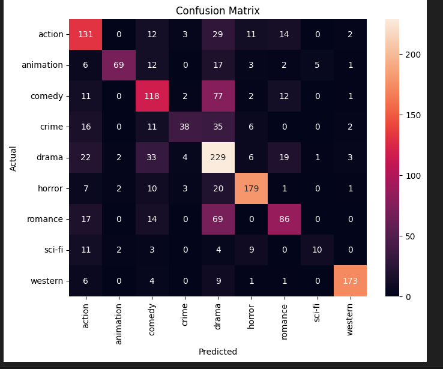

## tf-idf + SVC

- Used tf-idf with the clean plot
- Did a sentiment analysis on the clean plot from -1 to 1
- Added this extra feature to the tf-idf matrix
- Used a SVC to classify the movies

### Problems
- Confusion matrix:

- A lot of classes are misclassified as Drama

