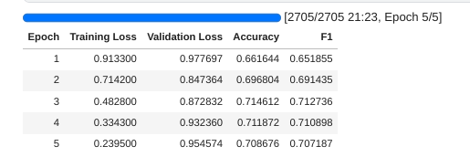
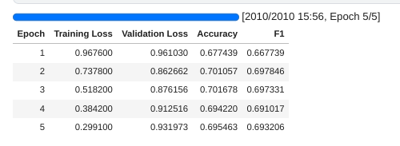

- With the Tokenizer using chunks:

- With the Tokenizer that truncates to 512 tokens:

- When trying LongForm, we had to reduce the batch sizes, accumulate gradients and use fp16. Still wasn't enough